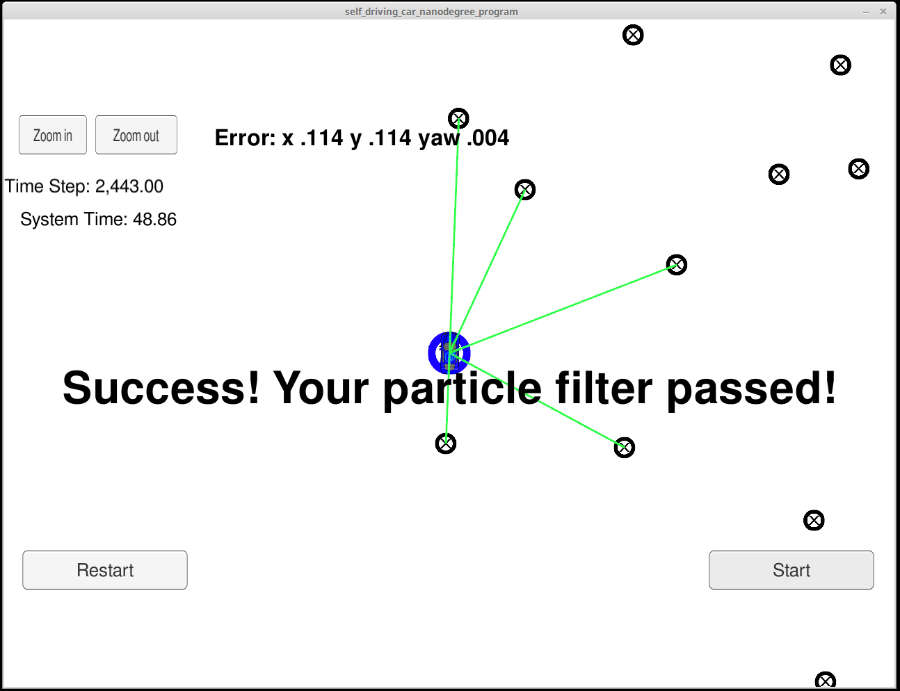

# Kidnapped Vehicle Project

Self-Driving Car Engineer Nanodegree Program

In this project I implemented a Particle Filter to accurately estimate the position of a car based on distance measurements to predetermined landmarks in the map. 

A number of particles are defined, which will be updated on each step. Particles with low probability to be close to the car position according to the measurements to the landmark, will be randomly discarded and instead particles with higher probability will be resampled. The accuracy of the filter is measured by the RMSE value of the highest probability particle.

The simulation delivers a great accuracy within the time specified in the [project rubric](https://review.udacity.com/#!/rubrics/1965/view).

<figure>
	
</figure>

## Code desdription

A starter code is given by the Udacity project contained in `/src`. To implement the full particle filter only the file `particle_filter.cpp` needed to be completed. The main functions, and steps in the implementation, are:

- **init()**: Initializes the particle randomly in a Gaussian distribution around the car's position given by the GPS.
The Gaussian distribution is implemented using `default_random_engine`, that picks values from the given distribution, and the distribution `normal_distribution`

		num_particles = 50;
		std::default_random_engine gen;
		normal_distribution<double> dist_x(x, std[0]);
		  	...
		for (int i = 0; i < num_particles; ++i) {
			....
			p.x = dist_x(gen);
			....
			particles.push_back(p);
		}
		ParticleFilter::is_initialized = true;

	Choosing	 even 9 particles was already enough to finish the simulation successfully, so 50 particles contains a big buffer without still compromising on execution speed. The simulation began to last more than the specified 100 seconds with 1200 particles, on my computer.

- **prediction()**: Updates the particles' position according to the motion model, and introducing the random Gaussian noise.
The motion model used is the bicycle model, where the particles' positions are updated accounting for their velocity and yaw rate. As the motion equations of the model include a division by the yaw rate, a particular case for zero or very small yaw rate is used as well to avoid divisions by zero.

		  for (unsigned int i = 0; i < particles.size(); ++i) {
		    normal_distribution<double> dist_x(particles[i].x, std_pos[0]);
				....
		    x_p = dist_x(gen);
				....
		    if (abs(yaw_rate) > 1e-8){
		      theta_0 = theta_p;
		      theta_f = theta_0 + yaw_rate * delta_t;
				...
		      particles[i].x = x_p + (velocity / yaw_rate) * (sin(theta_f) - sin(theta_0));
				...
		    }
		    else {
		      theta_0 = theta_p;
		      particles[i].x = x_p + velocity * delta_t * cos(theta_0);
				....
		    }
		  }

- **updateWeights()**: Assigns weights to the particles according to the probability to be at the correct car's position.

	First, the observations coordinates, that are given within our car system of coordinates, will be transformed to the map's system of coordinates:

	    vector<LandmarkObs> observations_mc;   // observations in map coordinates
	    for (unsigned int j=0; j < observations.size(); ++j) {
	      LandmarkObs obs_mc;
	      obs_mc.id = observations[j].id;
	      obs_mc.x = cos(particles[i].theta) * observations[j].x -
		         sin(particles[i].theta) * observations[j].y +
		         particles[i].x;
	      obs_mc.y = sin(particles[i].theta) * observations[j].x +
		         cos(particles[i].theta) * observations[j].y +
		         particles[i].y;
	      observations_mc.push_back(obs_mc);
	    }

	Second, the landmarks need to be converted to the same datatype as the coordinates. Next, each observation is associated to one landmark, just choosing the nearest one. This is done in the function dataAssociation().

	Finally, each observation has a certain probability to actually be the observation of its associated landmark, depending on how accurate, or close, the observation and the landmark are. This is calculated by the Multivariate-Gaussian probability density. The probability assigned to each particle is the multiplication of the probabilities of its corresponding observations. The probabilities of all particles is normalized in the last step.

		    for (unsigned int j=0; j < observations_mc.size(); ++j) {
		      mu_x = landmarks[observations_mc[j].id].x;
		      mu_y = landmarks[observations_mc[j].id].y;
		      exponent = -((pow(observations_mc[j].x - mu_x, 2) / (2 * pow(std_landmark[0], 2))) +
				   	  (pow(observations_mc[j].y - mu_y, 2) / (2 * pow(std_landmark[1], 2))) );
		      obs_prob = coeff * exp(exponent);
		      total_prob *= obs_prob;
		    }
		    particles[i].weight = total_prob;
		    weights_sum += particles[i].weight;
		  }
		  // Normalize
		  for (unsigned int i=0; i < particles.size(); ++i) {
		    particles[i].weight /= weights_sum;
		  }
  

- **resample()**: Chooses which particles pass to the next cycle, with repetition, according to their weights.

	As previously, I use `default_random_engine`, but the distribution to choose the particle indexes according to their weights is `discrete_distribution`

		std::default_random_engine gen;
		std::discrete_distribution<int> dist_weights(weights.begin(), weights.end());
		for (unsigned int i=0; i < particles.size(); i++) {
			index = dist_weights(gen);
			resampled_particles.push_back(particles[index]);
		}

## Installation and Build

This project involves the Term 2 Simulator which can be downloaded [here](https://github.com/udacity/self-driving-car-sim/releases).

Once you clone this repo, it includes two files that can be used to set up and install [uWebSocketIO](https://github.com/uWebSockets/uWebSockets) for either Linux or Mac systems. For windows you can use either Docker, VMware, or even [Windows 10 Bash on Ubuntu](https://www.howtogeek.com/249966/how-to-install-and-use-the-linux-bash-shell-on-windows-10/) to install uWebSocketIO. 

Once the install for uWebSocketIO is complete, the main program can be built and run by doing the following from the project top directory.

- Make a build directory: `mkdir build && cd build`
- Compile: `cmake .. && make` 
   * On windows, you may need to run: `cmake .. -G "Unix Makefiles" && make`
- Run it: `./ExtendedKF `

Refer to the [Udacity project repository](https://github.com/udacity/CarND-Extended-Kalman-Filter-Project) for more detail intalation instructions.

## Other Important Dependencies

* cmake >= 3.5
  * All OSes: [click here for installation instructions](https://cmake.org/install/)
* make >= 4.1 (Linux, Mac), 3.81 (Windows)
  * Linux: make is installed by default on most Linux distros
  * Mac: [install Xcode command line tools to get make](https://developer.apple.com/xcode/features/)
  * Windows: [Click here for installation instructions](http://gnuwin32.sourceforge.net/packages/make.htm)
* gcc/g++ >= 5.4
  * Linux: gcc / g++ is installed by default on most Linux distros
  * Mac: same deal as make - [install Xcode command line tools](https://developer.apple.com/xcode/features/)
  * Windows: recommend using [MinGW](http://www.mingw.org/)
